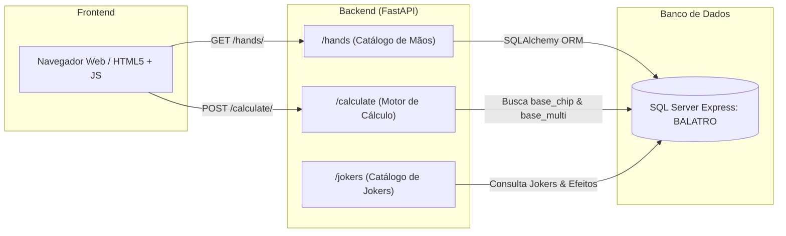
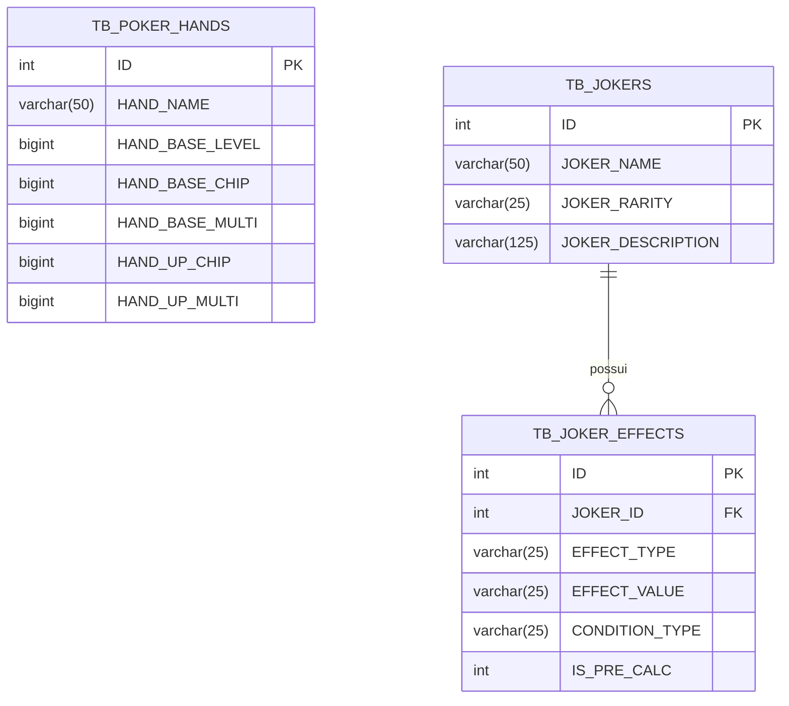

# 🃏 Documentação do Projeto: Balatro Hand Calculator (Versão 0.2)

Este documento resume a arquitetura, a modelagem de banco de dados, o backend em FastAPI e o frontend desenvolvidos para o simulador e calculadora de pontuações de mãos de poker do jogo *Balatro*.

---

## 📂 1. Estrutura de Pastas do Projeto

```text
balatro-calculator/
├── backend/
│   └── app/
│       ├── __init__.py
│       ├── database.py             # Conexão com SQL Server e SessionLocal
│       ├── main.py                 # Ponto de entrada FastAPI, CORS e inclusão de routers
│       ├── models.py               # Modelos relacionais SQLAlchemy (Mãos, Jokers e Efeitos)
│       ├── schemas.py              # Schemas de validação e serialização Pydantic
│       └── routers/
│           ├── __init__.py
│           ├── calculations.py     # Endpoint e motor de cálculo matemático das mãos
│           ├── hands.py            # Endpoints para consulta de mãos de poker
│           └── jokers.py           # Endpoints para consulta de Jokers e seus efeitos
├── frontend/
│   ├── index.html                  # Interface do usuário (formulário e exibição de pontuação)
│   ├── css/
│   │   └── style.css               # Folha de estilos personalizada com tema escuro
│   └── js/
│       └── app.js                  # Integração com a API (fetch dinâmico e manipulação de DOM)
├── tests/
└── README.md
```

---

## 🏗️ 2. Arquitetura e Visão Geral

O projeto adota uma arquitetura em camadas desacopladas (**Client-Server RESTful**), permitindo escalabilidade para futures mecânicas do jogo (Jokers, cartas de baralho e consumíveis):



### Componentes Principais:
1. **Frontend (Vanilla HTML5 / CSS3 / ES6+)**:
   - Totalmente estático, leve e responsivo.
   - Popula dinamicamente a lista de mãos disponíveis a partir do endpoint `GET /hands/`.
   - Envia requisições de cálculo para o endpoint `POST /calculate/` e atualiza a interface reativamente.
2. **Backend (FastAPI + SQLAlchemy)**:
   - Rotas assíncronas documentadas nativamente via OpenAPI/Swagger (`/docs`).
   - Gerenciamento de sessões com o banco de dados via injeção de dependência (`Depends(get_db)`).
   - Validação e tipagem de entrada/saída com schemas Pydantic.
3. **Persistência (SQL Server Express)**:
   - Armazena as características canônicas do Balatro (pontuações base e multiplicadores por nível de cada mão, tabela de Jokers e seus respectivos efeitos).

---

## 🗄️ 3. Modelagem de Dados (SQL Server Express)

A camada relacional está mapeada no SQLAlchemy através do [models.py](file:///c:/Users/andre/OneDrive/Desktop/Python-2025/project_balatro/backend/app/models.py):



### Estrutura das Tabelas:

#### 1. `TB_POKER_HANDS`
Armazena a definição base de cada mão de poker e a taxa de progressão por nível:
- `ID` (PK): Identificador primário da mão.
- `HAND_NAME`: Nome da mão (ex.: *Pair*, *Two Pair*, *Flush*, *Straight*, etc.).
- `HAND_BASE_LEVEL`: Nível inicial da mão (padrão: 1).
- `HAND_BASE_CHIP`: Fichas (Chips) concedidas no nível base.
- `HAND_BASE_MULTI`: Multiplicador concedido no nível base.
- `HAND_UP_CHIP`: Quantidade de Chips adicionada a cada nível ganho.
- `HAND_UP_MULTI`: Quantidade de Multiplicador adicionada a cada nível ganho.

#### 2. `TB_JOKERS`
Catálogo de Jokers disponíveis para compra e pontuação:
- `ID` (PK): Identificador do Joker.
- `JOKER_NAME`: Nome descritivo (ex.: *Joker*, *Greedy Joker*, *Lusty Joker*).
- `JOKER_RARITY`: Grau de raridade (*Common*, *Uncommon*, *Rare*, *Legendary*).
- `JOKER_DESCRIPTION`: Descrição dos atributos e condições.

#### 3. `TB_JOKER_EFFECTS`
Efeitos numéricos e lógicos associados a cada Joker:
- `ID` (PK): Identificador do efeito.
- `JOKER_ID` (FK): Chave estrangeira que referencia `TB_JOKERS.ID`.
- `EFFECT_TYPE`: Modificador aplicado (ex.: `+mult`, `xmult`, `+chips`).
- `EFFECT_VALUE`: Valor numérico da modificação.
- `CONDITION_TYPE`: Critério de disparo (ex.: naipe jogado, tipo de mão, descarte).
- `IS_PRE_CALC`: Momento da aplicação (`1` = pré-cálculo da mão, `0` = pós-cálculo).

---

## 🧮 4. Regras de Negócio e Mecânica Matemática de Cálculo

No jogo *Balatro*, o cálculo da pontuação de uma rodada resulta do produto direto entre **Chips** e o **Multiplicador (Mult)**:

$$\text{Pontuação Final} = \text{Chips} \times \text{Mult}$$

### Progressão Linear por Nível da Mão:
Quando uma mão é aprimorada (por exemplo, ao consumir cartas de Planeta), seus Chips e Mult aumentam de acordo com o delta de níveis:

$$\Delta L = \text{Nível Selecionado} - \text{Nível Base}$$

$$\text{Chips Calculados} = \text{Chips}_{\text{base}} + (\Delta L \times \text{Chips}_{\text{upgrade}})$$

$$\text{Mult Calculado} = \text{Mult}_{\text{base}} + (\Delta L \times \text{Mult}_{\text{upgrade}})$$

### Exemplo Numérico:
Considerando a mão **Flush** no Nível 3:
- Valores Base: $\text{Level Base} = 1$, $\text{Chips}_{\text{base}} = 35$, $\text{Mult}_{\text{base}} = 4$
- Upgrades por Nível: $\text{Up}_{\text{chip}} = 15$, $\text{Up}_{\text{multi}} = 2$
- Diferença de Nível: $\Delta L = 3 - 1 = 2$
- **Chips Totais:** $35 + (2 \times 15) = 65$
- **Mult Total:** $4 + (2 \times 2) = 8$
- **Pontuação:** $65 \times 8 = 520$

---

## 🚀 5. Endpoints da API (FastAPI)

| Método | Rota | Descrição | Status Retorno |
|---|---|---|---|
| `GET` | `/` | Boas-vindas e verificação de integridade | `200 OK` |
| `GET` | `/test-db` | Valida a conexão ativa com o banco SQL Server | `200 OK` |
| `GET` | `/hands/` | Lista todas as mãos disponíveis para seleção | `200 OK` |
| `GET` | `/hands/{hand_id}` | Obtém parâmetros detalhados de uma mão específica | `200 OK` |
| `GET` | `/jokers/` | Retorna o catálogo de Jokers cadastrados | `200 OK` |
| `GET` | `/jokers/{joker_id}` | Detalhes de um Joker específico | `200 OK` |
| `GET` | `/jokers/{joker_id}/effects` | Efeitos e regras associados ao Joker | `200 OK` |
| `POST`| `/calculate/` | Calcula Chips, Mult e Pontuação Total | `200 OK` |

### Exemplo de Entrada e Saída (`/calculate/`):

**Requisição:**
```json
{
  "hand_id": 1,
  "level": 3
}
```

**Resposta:**
```json
{
  "hand_id": 1,
  "hand_name": "Pair",
  "level": 3,
  "calculated_chips": 30,
  "calculated_multi": 4,
  "score": 120
}
```

---

## 💻 6. Frontend e Interação com a API

A interface web foi projetada para reproduzir o tema escuro característico do jogo *Balatro*, com visual limpo e feedback imediato:

- **Carregamento Automático (`loadHands`)**: Disparado no `DOMContentLoaded`, consulta `GET /hands/` e preenche o `<select id="handSelect">`.
- **Validação de Entrada (`calculateScore`)**: Valida se a mão selecionada e o nível são valores válidos ($\ge 1$).
- **Comunicação Assíncrona**: Utiliza a `Fetch API` para enviar o payload JSON ao backend e tratar erros de rede amigavelmente.
- **Apresentação dos Resultados**: Torna o `#resultCard` visível e exibe Chips, Mult e a Pontuação Total com formatação de números inteiros (`toLocaleString()`).

---

## 🛠️ 7. Guia de Instalação e Execução

### Pré-requisitos
- **Python 3.10 ou superior**
- **Microsoft SQL Server / SQL Server Express** com o banco `BALATRO`
- **ODBC Driver 17 for SQL Server**

### Execução Passo a Passo

1. **Ativar o Ambiente Virtual:**
   ```powershell
   .\.venv\Scripts\Activate.ps1
   ```

2. **Garantir Dependências Instaladas:**
   ```powershell
   pip install fastapi uvicorn sqlalchemy pyodbc pydantic
   ```

3. **Configuração da Conexão:**
   Ajuste `SERVER_NAME` e `DATABASE_NAME` em [backend/app/database.py](file:///c:/Users/andre/OneDrive/Desktop/Python-2025/project_balatro/backend/app/database.py) para o seu ambiente local:
   ```python
   SERVER_NAME = r"GHOST_RIDER\SQLEXPRESS"
   DATABASE_NAME = "BALATRO"
   ```

4. **Iniciar o Servidor Backend:**
   ```powershell
   uvicorn backend.app.main:app --reload
   ```
   Acesse a documentação interativa Swagger em: [http://127.0.0.1:8000/docs](http://127.0.0.1:8000/docs).

5. **Abrir o Frontend:**
   - Abra o arquivo [frontend/index.html](file:///c:/Users/andre/OneDrive/Desktop/Python-2025/project_balatro/frontend/index.html) diretamente no navegador ou via extensão Live Server.

---

## 🔮 8. Próximos Passos (Roadmap Versão 0.3+)

- [ ] **Incorporação de Jokers no Cálculo**: Permitir adicionar até 5 Jokers ativos na interface e aplicar efeitos aditivos (`+mult`, `+chips`) e multiplicativos (`xmult`) na ordem correta.
- [ ] **Seleção de Cartas Individuais**: Permitir escolher até 5 cartas jogadas para somar o valor de face (2 ao Ás) diretamente nos Chips base.
- [ ] **Edições de Cartas**: Suporte a cartas Foil (+50 Chips), Holographic (+10 Mult) e Polychrome (X1.5 Mult).
- [ ] **Aprimoramento Visual**: Animações temáticas de pontuação com inspiração retrô/CRT.