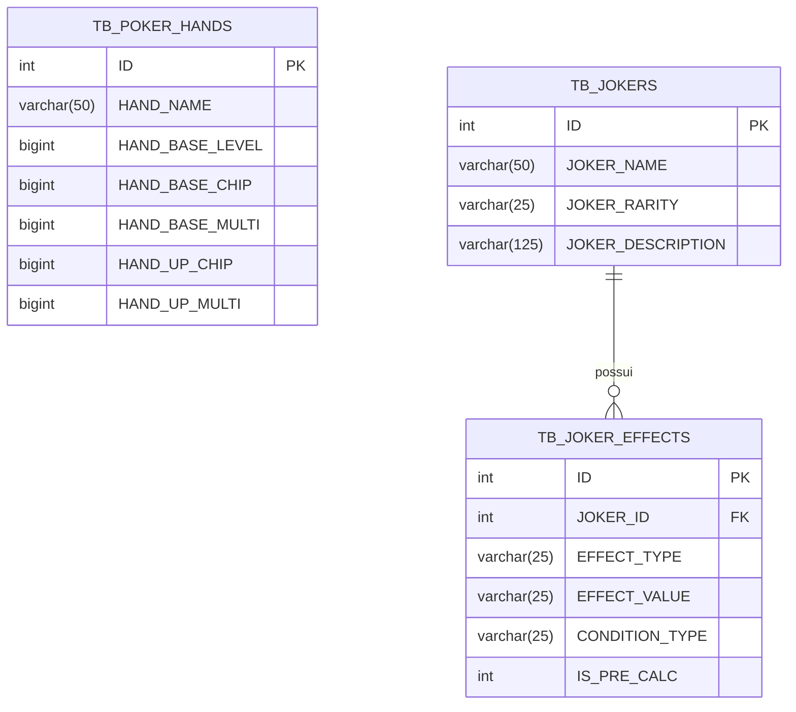

# 🃏 Documentação do Projeto: Balatro Hand Calculator (Versão 0.2)

Este documento resume a arquitetura, a modelagem de banco de dados, o backend em FastAPI e o frontend desenvolvidos para o simulador e calculadora de pontuações de mãos de poker do jogo *Balatro*.

---

## 📂 1. Estrutura de Pastas do Projeto

```text
balatro-calculator/
├── backend/
│   └── app/
│       ├── __init__.py
│       ├── database.py             # Configuração de conexão com SQL Server e SessionLocal
│       ├── main.py                 # Ponto de entrada FastAPI, CORS e inclusão de routers
│       ├── models.py               # Modelos relacionais SQLAlchemy (Mãos, Jokers e Efeitos)
│       ├── schemas.py              # Schemas de validação e serialização Pydantic
│       └── routers/
│           ├── __init__.py
│           ├── calculations.py     # Motor de cálculo matemático das mãos e Jokers
│           ├── hands.py            # Endpoints para consulta de mãos de poker
│           └── jokers.py           # Endpoints para consulta de Jokers e seus efeitos
├── frontend/
│   ├── index.html                  # Interface do usuário (formulário e exibição de pontuação)
│   ├── css/
│   │   └── style.css               # Folha de estilos personalizada com tema escuro
│   └── js/
│       └── app.js                  # Integração com a API (fetch dinâmico e manipulação de DOM)
├── tests/
└── README.md
```

---

## 🏗️ 2. Arquitetura e Visão Geral

O projeto segue o padrão **Client-Server RESTful**, separando a interface web interativa do motor de cálculo e da persistência de dados:

```mermaid
graph LR
    subgraph Frontend
        UI[Navegador Web / HTML5 + JS]
    end

    subgraph Backend_FastAPI ["Backend (FastAPI)"]
        RouterCalc["/calculate (Motor de Cálculo)"]
        RouterHands["/hands (Catálogo de Mãos)"]
        RouterJokers["/jokers (Catálogo de Jokers)"]
    end

    subgraph Database ["Banco de Dados"]
        SQL[(SQL Server Express: BALATRO)]
    end

    UI -->|GET /hands/| RouterHands
    UI -->|POST /calculate/ (com Jokers)| RouterCalc
    RouterHands -->|SQLAlchemy ORM| SQL
    RouterCalc -->|Busca base_chip & base_multi| SQL
    RouterCalc -->|Busca efeitos dos Jokers| SQL
    RouterJokers -->|Consulta Jokers & Efeitos| SQL
```

### Principais Componentes:
1. **Frontend (Vanilla HTML5 / CSS3 / ES6+)**:
   - Carrega dinamicamente a lista de mãos disponíveis no banco via API.
   - Permite ao usuário escolher a mão jogada e o nível atual.
   - Envia requisições assíncronas para o backend e exibe Chips, Multiplicador e Pontuação Total.
2. **Backend (FastAPI + SQLAlchemy)**:
   - Fornece documentação automática via Swagger (`/docs`) e ReDoc (`/redoc`).
   - Implementa CORS para comunicação fluida entre o frontend e a API.
   - Validação estrita de dados com Schemas Pydantic.
   - Motor de cálculo que processa a progressão da mão e aplica os bônus dos Jokers da mesa.
3. **Persistência (SQL Server Express)**:
   - Base de dados centralizada `BALATRO` com tabelas de mãos de poker, Jokers e seus efeitos/modificadores.

---

## 🗄️ 3. Modelagem de Dados (SQL Server Express)

A camada relacional está mapeada no SQLAlchemy através do arquivo `backend/app/models.py`:



### Detalhamento das Tabelas

#### `TB_POKER_HANDS` (Mãos de Poker)
- `ID` (PK): Identificador numérico da mão.
- `HAND_NAME`: Nome da mão (ex: *High Card*, *Pair*, *Flush*, *Full House*).
- `HAND_BASE_LEVEL`: Nível inicial padrão (normalmente 1).
- `HAND_BASE_CHIP`: Fichas (Chips) concedidas no nível base.
- `HAND_BASE_MULTI`: Multiplicador concedido no nível base.
- `HAND_UP_CHIP`: Incremento de fichas por cada nível adicional.
- `HAND_UP_MULTI`: Incremento de multiplicador por cada nível adicional.

#### `TB_JOKERS` (Catálogo de Jokers)
- `ID` (PK): Identificador do Joker.
- `JOKER_NAME`: Nome do Joker (ex: *Joker*, *Greedy Joker*, *Lusty Joker*).
- `JOKER_RARITY`: Grau de raridade (*Common*, *Uncommon*, *Rare*, *Legendary*).
- `JOKER_DESCRIPTION`: Descrição das habilidades do Joker no jogo.

#### `TB_JOKER_EFFECTS` (Regras e Efeitos de Jokers)
- `ID` (PK): Identificador do efeito.
- `JOKER_ID` (FK): Chave estrangeira referenciando `TB_JOKERS.ID`.
- `EFFECT_TYPE`: Tipo de modificação aplicada (`ADD_CHIP`, `ADD_MULTI`, `X_MULTI`).
- `EFFECT_VALUE`: Valor numérico da modificação (armazenado como texto e convertido dinamicamente).
- `CONDITION_TYPE`: Condição de ativação (ex: `NONE`, naipes específicos, descarte).
- `IS_PRE_CALC`: Momento do cálculo (`1` para antes do cálculo base, `0` para pós-cálculo).

---

## 🧮 4. Motor de Cálculo Matemático

No *Balatro*, a pontuação de qualquer mão é dada pelo produto direto entre **Chips (Fichas)** e o **Multiplicador (Mult)**:

$$\text{Pontuação Final} = \text{Chips} \times \text{Mult}$$

### 1. Progressão por Nível da Mão:
Quando uma mão é aprimorada, seus Chips e Mult aumentam linearmente com base no diferencial de níveis:

$$\Delta L = \text{Nível Atual} - \text{Nível Base}$$

$$\text{Chips}_{\text{mão}} = \text{Base Chips} + (\Delta L \times \text{Up Chips})$$

$$\text{Mult}_{\text{mão}} = \text{Base Mult} + (\Delta L \times \text{Up Mult})$$

### 2. Modificadores dos Jokers:
Com os Jokers ativos enviados na requisição, o motor de cálculo itera sobre cada Joker e seus efeitos cadastrados:
- **Efeitos de Fichas (`ADD_CHIP`):** Somam diretamente ao acumulador de fichas.
- **Multiplicadores Aditivos (`ADD_MULTI`):** Somam diretamente ao multiplicador acumulado.
- **Multiplicadores Exponenciais (`X_MULTI`):** Multiplicam o valor total de multiplicador acumulado até aquele ponto.

$$\text{Chips Final} = \text{Chips}_{\text{mão}} + \sum \text{Chips}_{\text{jokers}}$$

$$\text{Mult Final} = (\text{Mult}_{\text{mão}} + \sum \text{Mult}_{\text{aditivos}}) \times \prod \text{Fatores}_{\text{xmult}}$$

---

## 🚀 5. Endpoints da API (FastAPI)

| Método | Rota | Descrição | Status Sucesso |
|---|---|---|---|
| `GET` | `/` | Boas-vindas e status da API | `200 OK` |
| `GET` | `/test-db` | Testa a conectividade com o SQL Server Express | `200 OK` |
| `GET` | `/hands/` | Lista todas as mãos de poker cadastradas | `200 OK` |
| `GET` | `/hands/{hand_id}` | Obtém detalhes e valores base de uma mão específica | `200 OK` |
| `GET` | `/jokers/` | Lista todos os Jokers disponíveis | `200 OK` |
| `GET` | `/jokers/{joker_id}` | Consulta detalhes de um Joker por ID | `200 OK` |
| `GET` | `/jokers/{joker_id}/effects`| Consulta os efeitos vinculados a um Joker | `200 OK` |
| `POST`| `/calculate/` | Calcula Chips, Mult e Pontuação para mão, nível e Jokers dados | `200 OK` |

### Exemplo de Payload para `/calculate/`:

**Requisição (`POST /calculate/`):**
```json
{
  "hand_id": 2,
  "level": 1,
  "joker_ids": [1]
}
```

**Resposta:**
```json
{
  "hand_id": 2,
  "hand_name": "PAIR",
  "level": 1,
  "calculated_chips": 10,
  "calculated_multi": 6,
  "joker_ids": [1],
  "score": 60
}
```
*(Neste exemplo: Pair Nível 1 possui Base 10 Chips x 2 Mult. O Joker ID 1 com `ADD_MULTI = 4` elevou o multiplicador para 6, resultando em $10 \times 6 = 60$).*

---

## 💻 6. Frontend e Interação com a API

A interface foi concebida com foco em simplicidade e usabilidade, aplicando estilos inspirados na paleta visual de *Balatro* (tema escuro com tons esmeralda `#00b37e` e âmbar `#fba94c`).

- **Carregamento Assíncrono (`loadHands`)**: Ao disparar o evento `DOMContentLoaded`, o frontend efetua um `fetch` na rota `GET /hands/` e popula o elemento `<select id="handSelect">`.
- **Cálculo de Pontuação (`calculateScore`)**: Ao clicar em "Calcular Pontuação", os valores de ID e nível são validados e enviados em JSON para o endpoint `POST /calculate/`.
- **Renderização Reativa**: O cartão de resultados (`#resultCard`) tem a classe `.hidden` removida e exibe os Chips, Multiplicador e a pontuação formatada com separadores numéricos.

---

## 🛠️ 7. Guia de Instalação e Execução

### Pré-requisitos
- **Python 3.10+**
- **Microsoft SQL Server / SQL Server Express** com o banco `BALATRO`
- **ODBC Driver 17 for SQL Server** instalado no Windows

### Passo a Passo

1. **Ativar o Ambiente Virtual:**
   ```powershell
   .\.venv\Scripts\Activate.ps1
   ```

2. **Instalar Dependências (caso necessário):**
   ```powershell
   pip install fastapi uvicorn sqlalchemy pyodbc pydantic
   ```

3. **Verificar a Conexão com o Banco de Dados:**
   No arquivo `backend/app/database.py`, confirme se o nome da sua instância SQL Server e banco correspondem às suas configurações locais:
   ```python
   SERVER_NAME = r"GHOST_RIDER\SQLEXPRESS"
   DATABASE_NAME = "BALATRO"
   ```

4. **Iniciar o Servidor FastAPI:**
   ```powershell
   uvicorn backend.app.main:app --reload
   ```
   A API estará acessível em: `http://127.0.0.1:8000`  
   Documentação interativa Swagger: `http://127.0.0.1:8000/docs`

5. **Executar o Frontend:**
   - Abra o arquivo `frontend/index.html` diretamente em seu navegador ou utilize a extensão **Live Server** no VS Code / Antigravity.

---

## 🔮 8. Roadmap e Próximas Versões (Versão 0.3+)

- [x] **Integração dos Jokers no Motor de Cálculo**: Suporte ao recebimento de lista de Jokers, consulta de efeitos no banco (`TB_JOKER_EFFECTS`) e aplicação de bônus aditivos (`ADD_MULTI`, `ADD_CHIP`) e multiplicativos (`X_MULTI`).
- [ ] **Integração dos Jokers no Frontend**: Interface com slots interativos para equipar/desequipar Jokers e enviar seus IDs para o cálculo.
- [ ] **Seleção de Cartas Jogadas**: Adicionar pontuação das cartas individuais da mão (2 ao Ás) somando-se aos Chips base.
- [ ] **Modificadores de Cartas**: Suporte a edições especiais (Foil: `+50 Chips`, Holographic: `+10 Mult`, Polychrome: `X1.5 Mult`).
- [ ] **Cartas de Tarô e Planetas**: Simular abertura de pacotes e uso de consumíveis para subir níveis em tempo real.